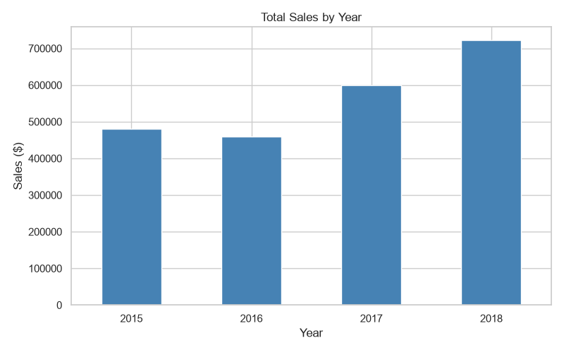

# Retail Sales Analysis

## Objective
Analyze retail sales data to find trends, profitable categories and loss-making products.

## Tools Used
Python, Pandas, Matplotlib, Seaborn

## Dataset
Superstore Sales Dataset (Kaggle), 9,994 transactions.

## What I Did
- Cleaned data (removed duplicates, fixed date formats)
- Created new columns (Year, Month, Profit Margin)
- Built 6 visualizations

## Key Insights
- (your sentence from Q1)
- (your sentence from Q2)
- (your sentence from Q3)
- (your sentence from Q4)
- (your sentence from Q5)
- (your sentence from Q6)

## Recommendations
- (recommendation 1)
- (recommendation 2)
- (recommendation 3)

## Charts

## How to Run
pip install pandas matplotlib seaborn
python analysis.py
